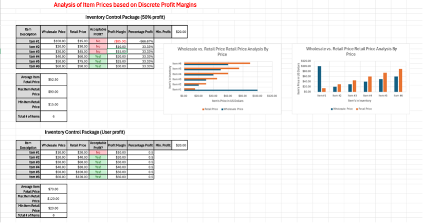

>>>>>>> c4e12bd5ca772adf7e4eaff6a207672bef46c163
# Miguel Maldonado-Briones
Contact Info: Cell: (443) 916-8825 // Email: Mjmaldonado-Briones@loyola.edu
### About Me 
Hello! I am an experienced paraprofessional Biology Lab Assistant with a year of proven expertise in Biohealth with a specialization in Biotechnology and Biopharma. 

With skills in data analysis, communication, detail-orientation, and teamwork, I am able to perform a Polymerase chain reaction (PCR) , and achieve making many copies of a specific DNA region. I am adept at using excel, Micro-centrifuges, and Pipettes and MS Access. 

My well-rounded skill set, commitment to detail, curiosity, and passion for knowledge makes me as a valuable asset.  In my spare time, I like to play classical music on the violin and go on daily runs. You can find me on www.linkedin.com/in/miguel-maldonado-briones-1391872a6.

### Education 
I am in my third year of university, at Loyola Univeristy, studing Biohealth with a specializationn in Biotech and biopharma.

***
### Projects

#### Project 1: Logic Functions and Conditional Formatting
For this prject, we used Microsoft excel to compare each items price and used a color system to differentiate wheter the profit margin is acceptable (color green) or not acceptable (color red).

Initial project idea: 
 It was an activity from class, assigned in the semester, the problem we are set to solve is to learn how to apply logic functions and conditional formatting to everyday life, its need to be solved because it would be a useful tool in a work setting.

 Tools I used: 
 The tool I used during this project was Microsoft Excel.

 Challenges I faced:
 Some challenges I faced were not correctly correlating the “profit margin”, and the “acceptable profit?” so it would change color from green to red, but I overcame the challenge but rewatching the recorded lecture.

 Other Resources: 
 I used the recorded lectures provided by the professor.

 Result:
 I was able to achieve my goal of being able to use logic function and conditional formatting, I was successful, some improvements I would like to make if I had the chance would be incorporating more colors like yellow for could improve.

***
#### Project 2: Repetition Structures – Loops, and Error Checking
For this project, we were assigned to create a personality quiz, and mine was based on fashion, so depending on the answer you choose, at the end of the quiz you would get a result on a specific styles while using loops and error checking in the python code.

Initial project idea: 
 It was an activity from class, assigned in the semester, the problem we are set to solve is to learn how to apply loops and error checking to everyday life, its need to be solved because it would be a useful tool in a work setting.

 Tools I used: 
 The tool I used during this project was JDoodle.

 Challenges I faced:
 Some challenges I was facing was not properly laying out the format for error checking while coding, and not repeating the question after the error, I was able to overcome this challenge by having my friend overlook my work and checking for the mistake and showing how to fix the mistake.

 Other Resources: 
 I used the recorded lectures provided by the professor and my friend, Angela!

 Result:
 I was able to achieve my goal of being able to use loops and error checking, I was successful, some improvements I would like to make if I had the chance would be adding a couple more questions, to have a more accurate result at the end.

***
#### Project 3: Using Queries to Make Decisions
For this project, I created a list of 10 customers and prodvided basic information for each such as address, their zip code and the state they lived in , and another list of 10 products items and who bought what item usign relationships and queries.

Initial project idea: 
 It was an activity from class, assigned in the semester, the problem we are set to solve is to learn how to apply queries to make specific decisions in everyday life, its need to be solved because it would be a useful tool in a work setting.

 Tools I used: 
 The tool I used for this project is Microsoft Access

 Challenges I faced:
 Some challenges I was facing was not properly connecting the customer information to the product information, so every time I ran the query, nothing would show up. I overcame the challenge by rewatching the recorded lecture.

 Other Resources: 
 I used the recorded lectures provided by the professor.

 Result:
 I was able to achieve my goal of being able to use queries, I was successful, some improvements I would like to make if I had the chance would be adding more information to the customer and more products.
